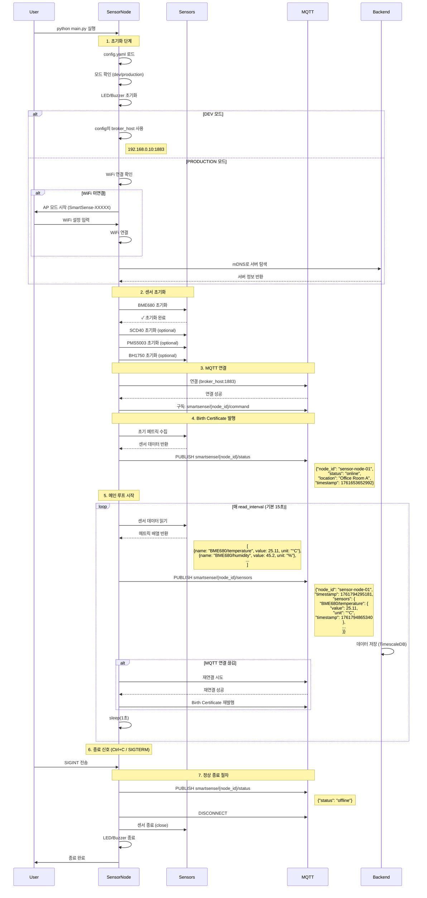

# SmartSense Sensor Node - Architecture

## 📊 시스템 흐름도

### 전체 동작 순서



## 주요 컴포넌트

### 1. 초기화 단계
- **설정 로드**: `config.yaml` 파일에서 센서 설정, MQTT 브로커 정보 읽기
- **모드 선택**: DEV (개발) 또는 PRODUCTION (프로덕션) 모드
- **출력 장치**: LED와 Buzzer 초기화 (상태 표시용)

### 2. 네트워크 설정
**DEV 모드**:
- `config.yaml`의 `broker_host` 직접 사용
- mDNS 서버 탐색 건너뜀

**PRODUCTION 모드**:
- WiFi 연결 상태 확인
- 미연결 시 AP 모드로 WiFi Provisioning
- mDNS를 통한 SmartSense 서버 자동 탐색

### 3. 센서 초기화
활성화된 센서들을 순차적으로 초기화:
- BME680 (온도, 습도, 압력, VOC)
- SCD40 (CO2)
- PMS5003 (미세먼지)
- BH1750 (조도)

실패한 센서는 건너뛰고 계속 진행

### 4. MQTT 통신
- **연결**: 설정된 브로커에 연결
- **구독**: `smartsense/{node_id}/command` 토픽 구독
- **발행**: 상태 및 센서 데이터 발행

### 5. 메인 루프
- **읽기 주기**: `read_interval` 설정값 (기본 15초)
- **데이터 수집**: 모든 활성화된 센서에서 데이터 읽기
- **MQTT 발행**: 수집된 데이터를 MQTT 브로커로 전송
- **연결 관리**: MQTT 연결 상태 확인 및 자동 재연결

### 6. 종료 처리
- **정상 종료**: SIGINT/SIGTERM 신호 처리
- **상태 알림**: offline 상태 발행
- **리소스 정리**: MQTT 연결 종료, 센서 정리, LED/Buzzer 종료

## 상태 LED 패턴

| 상태 | LED 색상 | 패턴 | 의미 |
|------|---------|------|------|
| 초기화 중 | Green | 2회 깜빡임 | 네트워크 연결 성공 |
| 프로비저닝 모드 | Blue | 0.5초 간격 5회 | WiFi 설정 대기 |
| WiFi 연결 시도 | Yellow | 3회 깜빡임 | WiFi 연결 중 |
| 정상 동작 | Green | 상시 켜짐 | 모든 시스템 정상 |
| 데이터 전송 | Green | 0.1초 깜빡임 | MQTT 데이터 발행 |
| MQTT 연결 끊김 | Yellow | - | 재연결 시도 중 |
| 오류 발생 | Red | 3회 깜빡임 | 에러 발생 |
| 종료 | Red | 0.5초 켜짐 후 꺼짐 | 정상 종료 |

## 파일 구조

```
sensor-node/
├── main.py                 # 메인 엔트리포인트
├── config.yaml             # 설정 파일
├── mqtt/
│   └── client.py           # MQTT 클라이언트
├── sensors/
│   ├── base_sensor.py      # 센서 베이스 클래스
│   ├── bme680.py           # BME680 센서
│   ├── scd40.py            # SCD40 센서
│   ├── pms5003.py          # PMS5003 센서
│   └── bh1750.py           # BH1750 센서
├── outputs/
│   ├── led.py              # LED 컨트롤러
│   └── buzzer.py           # Buzzer 컨트롤러
└── utils/
    ├── config_loader.py    # 설정 로더
    ├── wifi_provisioning.py # WiFi 프로비저닝
    ├── mdns_discovery.py   # mDNS 서버 탐색
    └── network_check.py    # 네트워크 체크
```

## 에러 처리

### 센서 초기화 실패
- 개별 센서 실패 시: 경고 로그 출력 후 해당 센서 건너뜀
- 모든 센서 실패 시: 프로그램 종료

### MQTT 연결 실패
- 초기 연결 실패: 프로그램 종료
- 런타임 연결 끊김: 자동 재연결 시도 (무한 루프)

### 데이터 읽기 오류
- 개별 센서 오류: 에러 로그 출력 후 계속 진행
- 발행 실패: 경고 로그 출력, 다음 주기에 재시도
